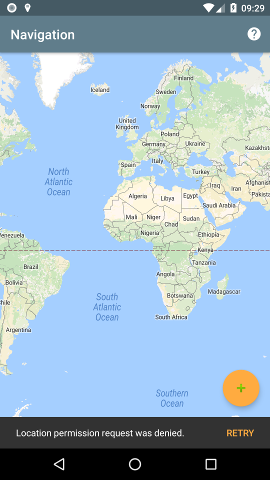
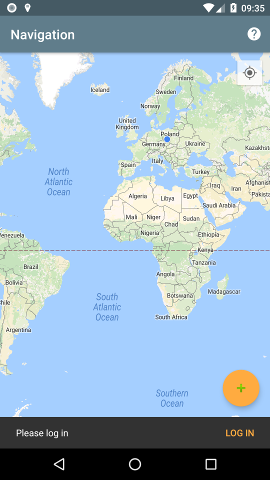
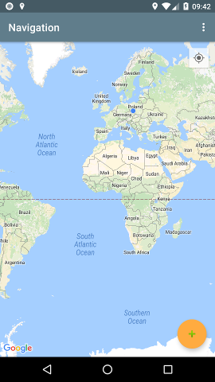
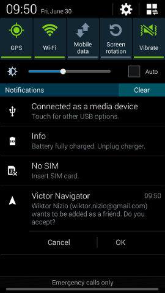
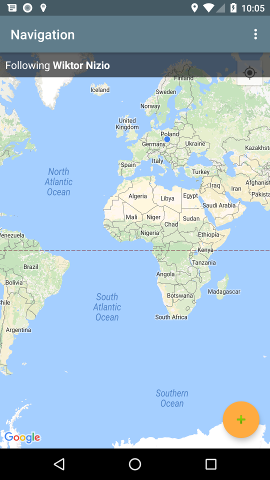

# Wiktor-Navigator (Android)

<h1 align=center>

</h1>

Like GPS-Texter, it shares your location with one other person. This time it uses Firebase Realtime Database to save on SMS fees. Use your Gmail account to sign in.

When beginning to use the program, please grant location permission. Without it the program will not be able to track your location. You will also not be able to see location of your friend.

After granting location permission you will probably see a blue dot on the map indicating you current location. Please tap in the lower right corner of you screen to log in. If you want to see how your data is going to be used, kindly tap the question mark symbol in the upper right corner. This will display a link to our privacy policy.

You can now press + to add friend. Please follow on-screen instructions to find friends using their Gmail address. If you already have some friends in your contact list, you can remove them from your phone by swiping with your finger to the left or right. Please note that your friend will have to accept your request in order for them to be added to your list.

If you are logged in to the program and somebody wanted to add you to their friends list, you will be notified using Android notification. Please press OK to grant the request. They will be automatically added to your list as well.

When following a friend, their name will appear at the top of the screen. You can swipe this banner to stop following them. You can only follow one friend at a time.

When your device is stationary, no data is sent to the Internet to save data and battery power. You will still receive location updates from your friend.

**Donate bitcoin:** bc1qncxh5xs6erq6w4qz3a7xl7f50agrgn3w58dsfp